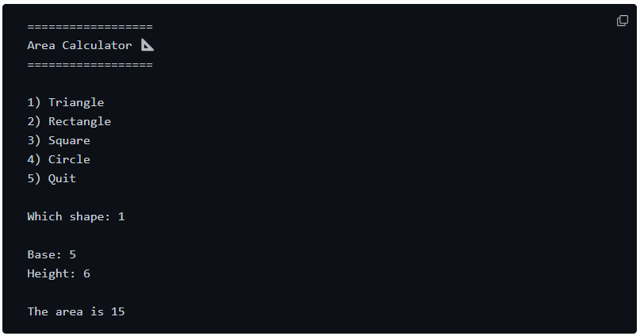

# Area-Project Mini-Project
### This is a mini project I completed as part of the Codedex checkpoint project in the Legend of Python course. This project was built in VS code using Python. 

### Below is the image of the expect output by Codedex:

## Tools Used
[Codedex](https://www.codedex.io/python/checkpoint-project/area-calculator) - Project specification

#### GitHub - Host code
#### VS Code - Create code and ReadMe
